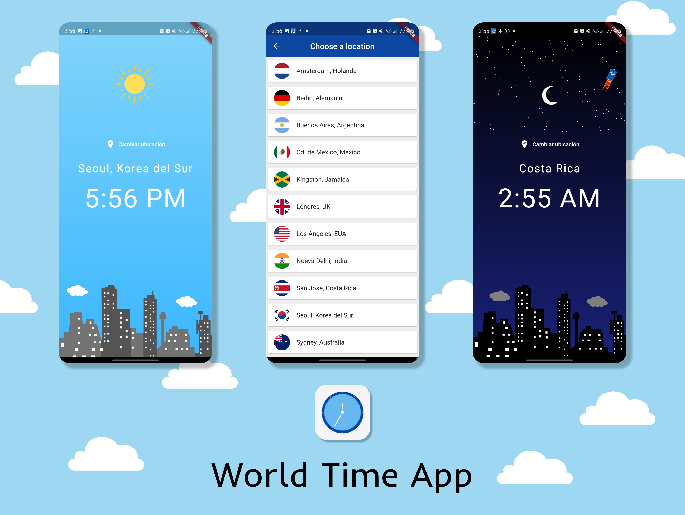

# World Time App

Primer proyecto en Flutter en el que se crea un app que muestra la hora de varias ciudades alrededor del mundo. Para ello se hace uso de el [TimeAPI](https://timeapi.io).

Se cuenta con una pantalla principal en la que se muestra la hora con un fondo que cambia entre día y noche. 

En la pantalla de ubicaciones se muestran el resto de ciudades.

Esta app es el resultado de completar el curso de introducción a Flutter por The Net Ninja en youtube